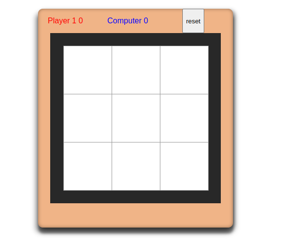
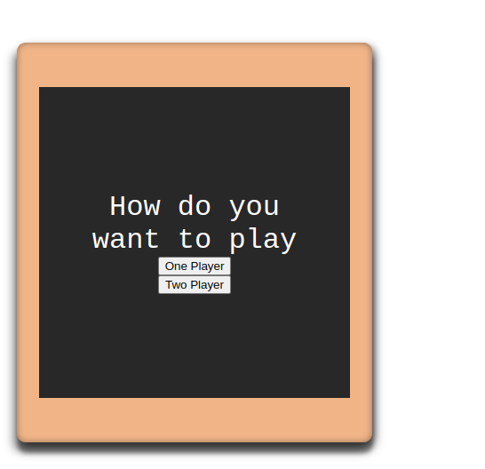
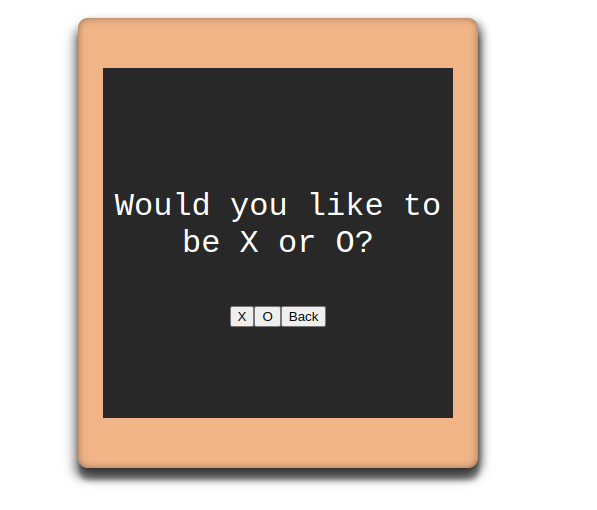

# React Tic Tac Toe Game

This is a simple Tic Tac Toe game built with React.

## Features

- Play against a computer AI or another player
- Responsive design for various screen sizes
- Keeps track of the game's status (win, lose, draw)

## Installation

1. Clone this repository: `git clonehttps://github.com/aliveevie/Tic-toe-game.git`
2. Navigate to the project directory: `cd react-Iic-tac-toe-game`
3. Install dependencies: `npm install`

## Usage

1. Start the development server: `npm start`
2. Open your browser and go to `http://localhost:3000` to play the game

## Deploying to Netlify

1. Create a Netlify account if you don't have one: https://www.netlify.com/
2. Log in to Netlify and click the "New site from Git" button
3. Connect your GitHub repository where you've pushed your Tic Tac Toe project
4. Configure the build settings:
   - Build command: `npm run build`
   - Publish directory: `build`
5. Click "Deploy site"

## Live Demo

You can play the game online: [Tic Tac Toe Game](https://64ca878ce6fd9d17001b1211--cheery-dusk-71bebe.netlify.app)

## Screenshots

## Contributing

Feel free to contribute to the project by opening issues or pull requests.

